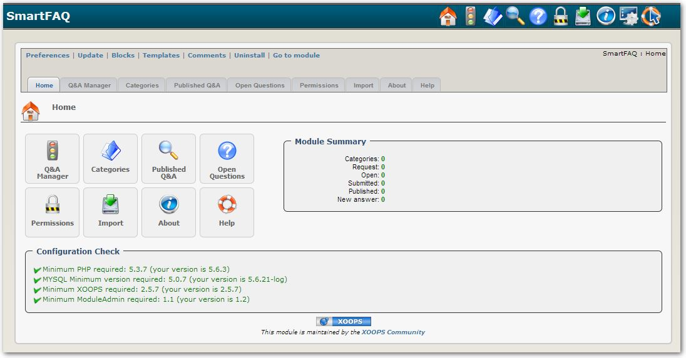

# Introduction

## Module SmartFAQ

#### for XOOPS 2.5.9

### User Manual

© 2018 XOOPS Project \(www.xoops.org\)

### Module Purpose

SmartFAQ, as you would probably have guessed it by the name, is a Frequently Asked Questions system for XOOPS 2.5.7 web sites. Compared to other FAQ modules, SmartFAQ offers exciting functionalities that will help communities to quickly and easily build a complete FAQ system for their sites. Here is some of the features of SmartFAQ :

* Users can request a Q&A
* Accepted requests are published in the Open Questions section.
* Users can see, in the Open Questions section, the questions that are yet unanswered.
* Users can propose answers to these questions.
* When an answer is approved, the Q&A is published in the Q&A section.
* Each Q&A can have other information like a 'Did you know?' and 'How do I?' statement.
* These statements can be randomly displayed in blocks, along with a link for the complete answer.
* Q&A can be linked to a specific module or a specific URL.
* If such a link is made, the Contextual Q&A block will display contextual Q&A relatively to where the user is on your site.
* At any time, users can submit a better answer for a Q&A that already has an answer. This newly submitted answer will obviously need to be approved by a moderator.

 _Figure 1: Main view of the Module Admin side_

## Download/Fork the Module  

**You can fork the module --&gt;** [**here**](https://github.com/XoopsModules25x/smartfaq)**\)**

### How to Contribute

[You can contribute on GitHub](https://github.com/XoopsDocs/smartfaq-tutorial). Changes will be [pushed to Gitbook.io automatically](https://www.gitbook.com/book/xoops/smartfaq-tutorial/activity) when the [main repository](https://github.com/XoopsDocs/smartfaq-tutorial) changes.

Editing the book can be done either by updating the markdown files with a text editor, or opening the repository in [the Gitbook desktop app](https://github.com/GitbookIO/editor/blob/master/README.md). The desktop app will give you a live preview option.

## Table of Content

* [Overview](overview.md)  
* **Administrators Guide**  
* [Install/Uninstall](install-uninstall.md)
* [Administration Menu](administration-menu.md)
* [Import Function](import-function.md)
* [Operating Instructions](operating-instructions/)
  * [Preferences](operating-instructions/preferences.md)
  * [Display Type, Pagination](operating-instructions/display-type-pagination.md) 
  * [Categories](operating-instructions/categories.md)
  * [Permissions](operating-instructions/permissions.md)
  * [Blocks & Groups](operating-instructions/blocks-and-groups.md)
  * [Q&A Entering Question and Answers](operating-instructions/q-and-a-entering-question-and-answers.md)
  * [Open Questions](operating-instructions/open-questions.md)
  * [Managing content in SmartFAQ module](operating-instructions/managing-content-in-smartfaq-module/)
    * [Sort Order & Status options](operating-instructions/managing-content-in-smartfaq-module/sort-order-and-status-options.md)
    * [Edit submissions.](operating-instructions/managing-content-in-smartfaq-module/edit-submissions..md)  
* **Guide for Users**   
* [The module index page.](the-module-index-page..md)
* [Category Summary - text link](https://github.com/xoops/smartfaq-tutorial/tree/d31651f51362e8bde4fba68a371aaaf271be37c4/en/book/users/8.1Category%20Summary.md)
* [Category Summary - link Last Q&A published](category-summary-link-last-q-and-a-published.md)
* [Category summary, Sub-category - link last Q&A published](category-summary-sub-category-link-last-q-and-a-published.md)
* [Last published Q&A - link](last-published-q-and-a-link.md)
* [Categories, Subcategory -text link](categories-subcategory-text-link.md)
* [Open question menu - link](open-question-menu-link.md)
* [Request QA menu - link](request-qa-menu-link.md)
* [Submit a Q&A menu - link](submit-a-q-and-a-menu-link.md)
* [Blocks](blocks/)
    * Did you know? block -More details link
    * Random question block answer link
    * How do I ... block answer here! link
* [User Icons](user-icons/)
  * [User- Print](user-icons/user-print.md)
  * [User- Send](user-icons/user-send.md)
  * [User- New Answer](user-icons/user-new-answer.md)
  * [User- Edit](user-icons/user-edit.md)
  * [User- Delete](user-icons/user-delete.md)
* [Entering Content.](entering-content..md)
* [Notifications](notifications.md)
* [Notification template examples](notification-template-examples.md)
* [Module Credits](module-credits.md)

  
  
  **References**  
  

* SmartFAQ Workflow Charts
  * [SmartFAQ Workflow](smartfaq-workflow-charts/smartfaq-workflow.md)
  * [FAQ Notifications](smartfaq-workflow-charts/faq-notifications.md)
  * [Question Notification](smartfaq-workflow-charts/question-notification.md)
* [Applications](applications.md)
* [Dublin Core Metadata](dublin-core-metadata.md)
* [XOOPS Content Management System](xoops-content-management-system.md)

### License:

  
Unless specified, this content is licensed under a [Creative Commons Attribution-NonCommercial-ShareAlike 4.0 International License](http://creativecommons.org/licenses/by-nc-sa/4.0/).

All derivative works are to be attributed to XOOPS Project \([www.xoops.org](https://xoops.org)\)

All derivative works are to be attributed to XOOPS Project ([www.xoops.org](https://xoops.org))
