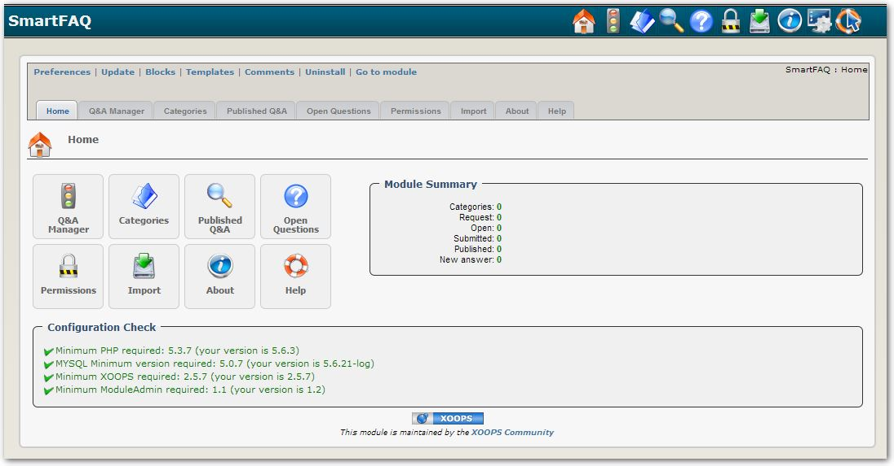

### _XOOPS Documentation Series_

# Module SmartFAQ
#### for XOOPS 2.5.7

## User Manual

© 2014 The XOOPS Project (www.xoops.org)

## Module Purpose

SmartFAQ, as you would probably have guessed it by the name, is a Frequently Asked Questions system for XOOPS 2.5.7 web sites. Compared to other FAQ modules, SmartFAQ offers exciting functionalities that will help communities to quickly and easily build a complete FAQ system for their sites. Here is some of the features of SmartFAQ :

- Users can request a Q&A
- Accepted requests are published in the Open Questions section.
- Users can see, in the Open Questions section, the questions that are yet unanswered.
- Users can propose answers to these questions.
- When an answer is approved, the Q&A is published in the Q&A section.
- Each Q&A can have other information like a 'Did you know?' and 'How do I?' statement.
- These statements can be randomly displayed in blocks, along with a link for the complete answer.
- Q&A can be linked to a specific module or a specific URL.
- If such a link is made, the Contextual Q&A block will display contextual Q&A relatively to where the user is on your site.
- At any time, users can submit a better answer for a Q&A that already has an answer. This newly submitted answer will obviously need to be approved by a moderator.

*Figure 1: Main view of the XXX Module (Admin side)*

# Table of Content

* [Install/Uninstall](book/1install.md)
* [Administration Menu](book/2administration.md)
* [Preferences](book/3preferences.md)
* [Operating Instructions](book/4operations.md)
* [The User Side](book/5userside.md)
* [Blocks](book/6blocks.md)
* [Templates](book/7templates.md)
* [Other](book/8other.md) //delete, if not used
* [Module Credits](book/9credits.md)

##License:

 Unless specified, this content is licensed under a <a rel="license" href="http://creativecommons.org/licenses/by-nc-sa/4.0/">Creative Commons Attribution-NonCommercial-ShareAlike 4.0 International License</a>.

All derivative works are to be attributed to XOOPS Project (www.xoops.org)
