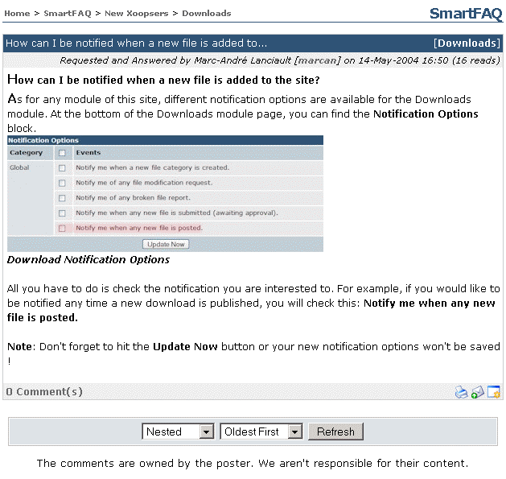
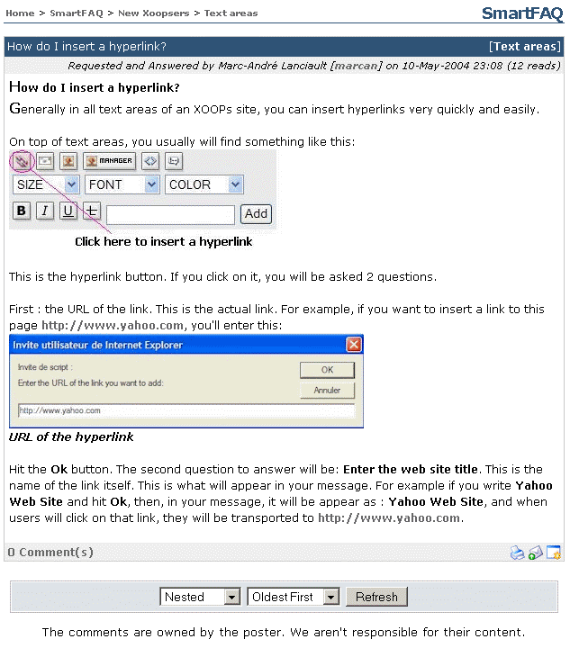
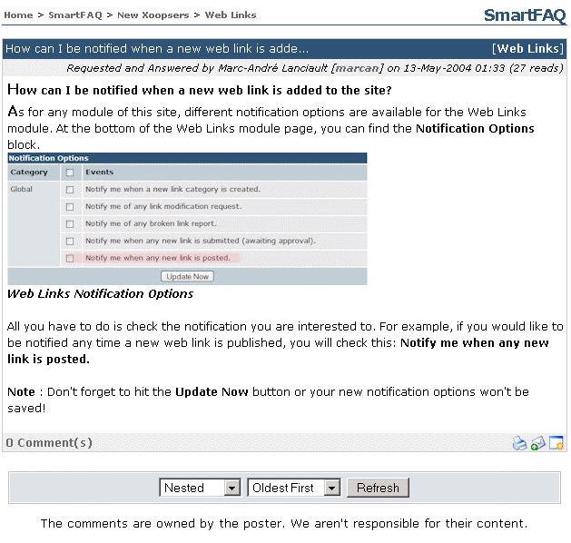

# Blocks

## Did you know block

If the 'Did you know ... block is displayed, the more details link will open a page displaying the full details of the information statement.

**Page: /modules/system/admin.php?fct=preferences&op=showmod&mod=24** 

Fig. 29 Did you know block

## Random question \(block\) answer link

If the Random Question block is displayed, clicking Answer here! link opens a details page. Other details are also shown such as Name of submitter, date and user reads.

**Page: /modules/system/admin.php?fct=preferences&op=showmod&mod=24** 

Fig. 30 Random question \(block\) answer link

## How do I ... \(block\) answer here! link

If The How do I ... block is displayed, the answer here link opens a detailed page showing the question and the answer.

**Page: /modules/smartfaq/faq.php?faqid=50** 

Fig. 31 How do I ... \(block\) answer here! link.

