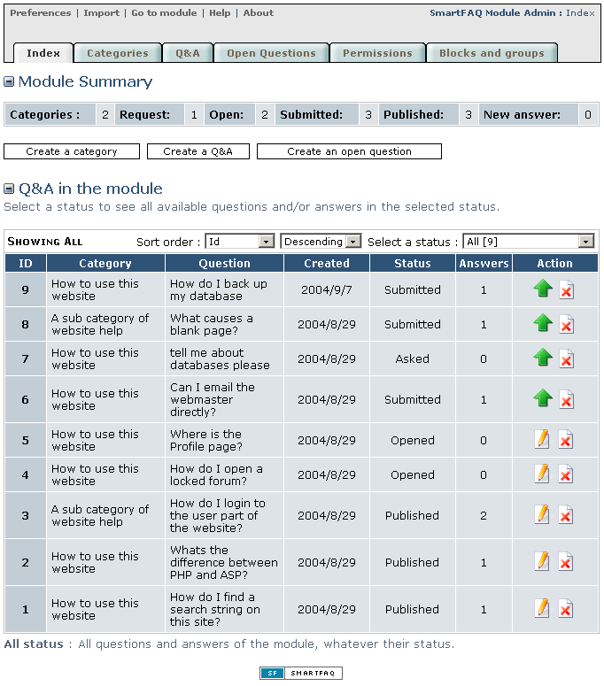

# 1.0 Install/Uninstall

1. Installation follows the usual Xoops routine. After downloading the module distribution pack, decompress the file and open the folder and any nested folder beneath until you find the main module files. These will be in a folder called smartfaq. This parent folder will be uploaded to your server into the 'Modules' directory. Now open and view and 'Readme' or changelog files and follow any directions given. There are no pre-install configurations required for this module.     
2. Using your usual FTP client upload the smartfaq directory to you 'modules' directory of your website files.    
3. Open your website administration page and go to 'modules'    
4. Install the module by clicking the install link. A confirmation page should give you a link back to 'module administration page'

# Administration

## Configuration

We need to setup preferences and create at least one category before the module becomes functional. Before we do this let's visit the main index page and see what's available in the administration section. This image shows the index page on initial installation. Both 'Module summary' and 'Q&A in the module' tables will display content once the categories and questions have been entered. Please note. The module will not display any content until at least one category has been created.

Page: /modules/smartfaq/admin/index.php

