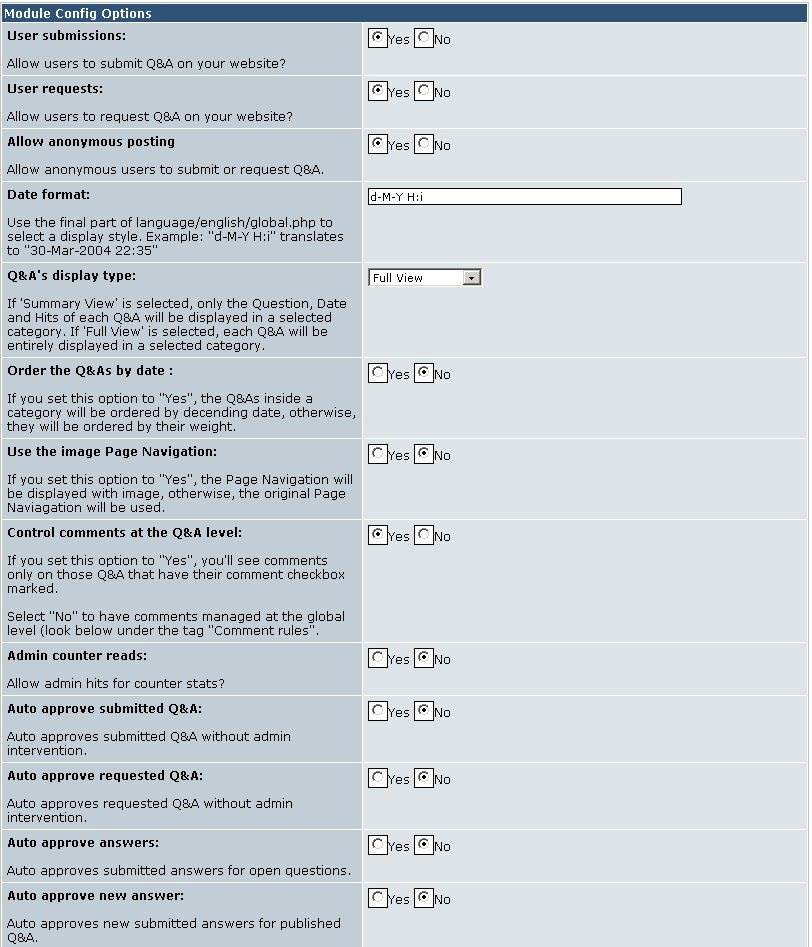
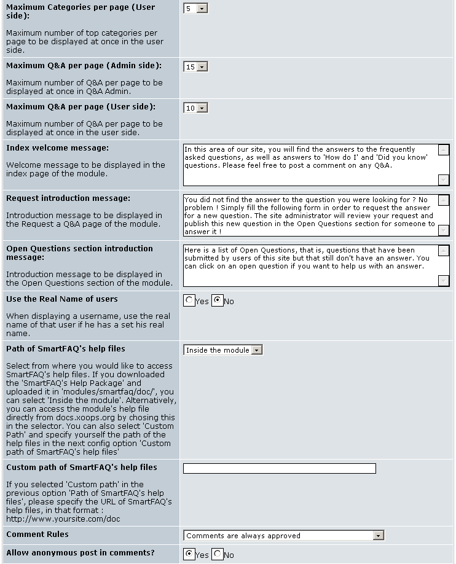
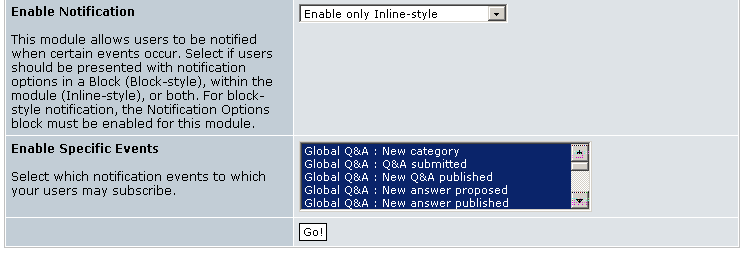

# Preferences

We will now open the preferences page. The module will work with the default values that you will see below, but you may wish to change some of these. Most of these settings have brief explanations against them, but we have added detailed help notes over some of these settings. Please note, the preferences page is long, so it has been divided into 2 sections in the images below.

>**Note: **
>The Auto approve sections adds extra convenience and security. If you are allowing the submit and request links to be viewed in your web pages, you can still prevent automatic publication of any material by setting these auto approve options to NO. Alternatively, if you restrict your module visibility to a trusted group, it may be useful to allow auto approve which offers immediate publication of material. ~~More details are given in the tool tips below.~~

Page: /modules/system/admin.php?fct=preferences&op=showmod&mod=24

  

  
  

