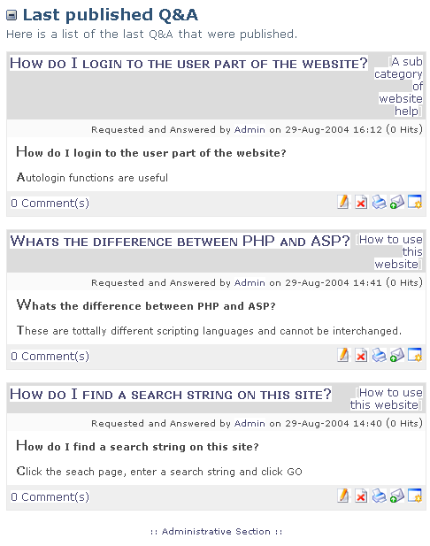
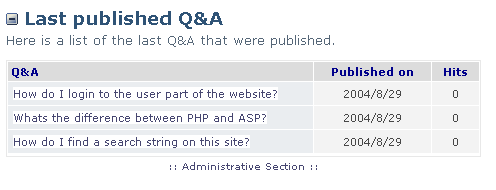
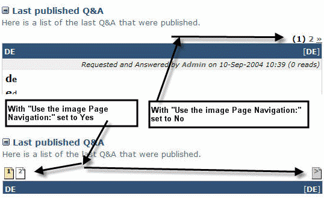

# 2.1 Display Types

# 2.1 Other Preferences

### Display Types (Full View or Summary View.)

Administrators have an option in Preferences called Q&As display type. This setting will either show all Q&As to display as Full View where questions including answers are shown, or simply in Summary View. Here, only the question title is displayed in a list. The Question title becomes a clickable link that opens the full question and answer in another page. The summary option is useful if many questions need to be listed in a single page.

 >**Note:** this is an administration setting and cannot be changed by users.

Page: /modules/system/admin.php?fct=preferences&op=showmod&mod=24

  
Showing "Full View"

  

Showing "Summary View"

### Page Navigation

Administrators have an option in Preferences called **Use the image page navigation**. Setting this option to **Yes**. will display any additional module pages in the website as page icons to the left of the page header and with an arrow to the right advance to the next page. If set to No additional pages are shown as clickable numbers to the right of the page header, with a double chevron to advance to the next page. In both options numbers and icons are clickable to select specific pages..

Page: /modules/smartfaq/

  
