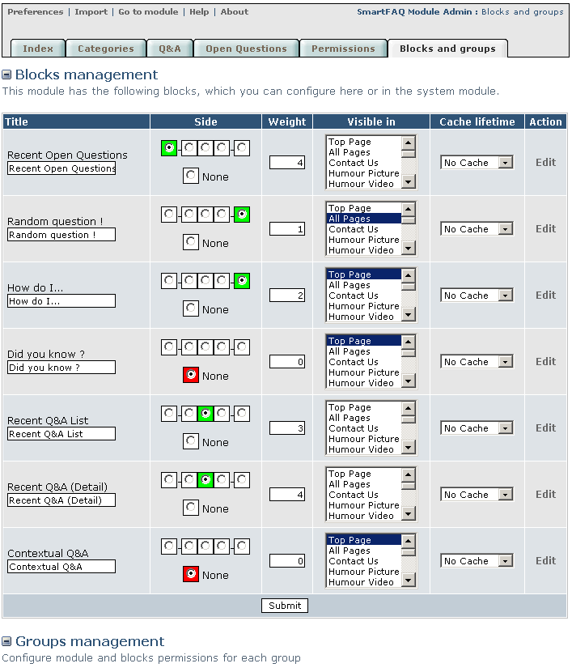

# Blocks and groups

Blocks and Groups page combines administration/Blocks and administration/Groups settings that you usually have to go to after you have installed a module. The difference is that SmartFAQ displays only settings related to the module and nothing else. When you make settings here and then go to your usual blocks and groups pages, you will see that all this data has been registered in the usual way. It's simply much easier and more convenient. You will see that there is an edit link after each block description. We will look at the edit page in section 5:1

Page: /modules/smartfaq/admin/myblocksadmin.php

 

Fig. 12 Blocks and groups page

> **How to moderate in SmartFAQ?**
>
>You could create a group in your system admin. called 'Moderators' Place your moderators in this group and give them 'SmartFAQ Module Access Rights' They will now be able to see all the edit and delete links in the module content and also access the administration link, but ONLY to the SmartFAQ module. ( Caution; They will have ALL rights to this module )