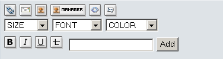
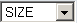

# Entering Content

The Submit Q&A link in the main menu opens a detailed form for creating a question and answer combination. The answer field can be short or detailed as required. There is no limitation to length of the detailed answer. 
If you use the DHTML Editor, SmartFAQ offers some useful formatting options as follows:

**Page: /modules/smartfaq/submit.php?op=add **

  URL. Allows URLs to be inputted as clickable links against a different label

  email. Allows email addresses to be inputted as clickable links evoking default email client

  imgscr. Allows an image to be displayed in the page by calling its URL from a remote server.

  image manager. Allows selected images from image manager to be inserted into the page .

  code. Allows scripting code to be inserted, maintaining presentation.

  quote. Allows a piece of text to be segregated in a highlighted box, denoting a quoted source.

  Selector Options for different size of text to be inputted

  Selector Options for selected alternative fonts to be used

  Selector Options for selected colours to be used with fonts and texts options above.

  All text to be formatted should be entered in this field before apply formatting options.

  bold. Causes text to be bolded.

  italic. Causes text to be italicized.

  underline. Causes text to be underlined.
 
 linethrough.  Causes text to have a line through. 

