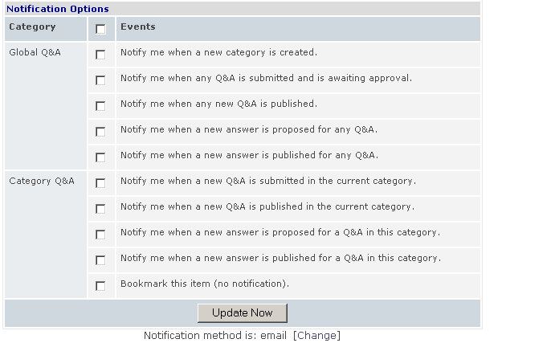
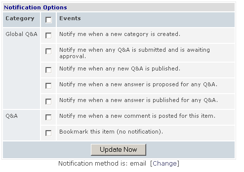
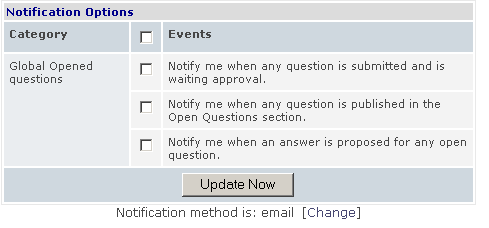
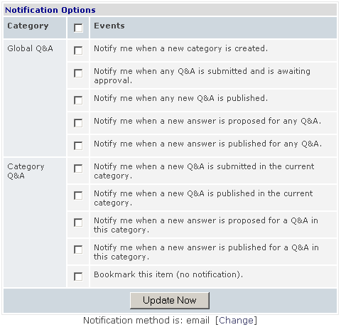
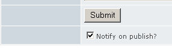
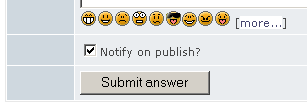

# Notifications

SmartFAQ features full content **Notifications**. This is part of the Xoops system notifications and the options needs to be set to display in the module **preferences page**. Notifications are an efficient way of keeping up to date and informed of all kinds of activities in the SmartFAQ module. You can be notified for various levels of changes, from new categories created down to a new answer submitted for a specific question that you have asked. This feature provides a similar response to a 'Help Desk' . There are many options available to administrators to display notifications types. These will vary according to specific websites setups. This page outlines all available options. If you are an administrator of a site, this help page will be useful in conjunction with setting option for notifications in the **preferences page** .

Page: Various. (Examples of notification block may be displayed in center block [inline] or as below, or in a side block)

Submitting an open question

#### Submitting a Q&A

Here is the full list of available notification options available in **admin/ preferences** (enable specific events) with descriptions.

 Click bold numbers in red open pages with template xeamples

Admin selection options.|Notification option in web page. (with template examples)
---|---
Global Q&A : New category|	1- Notify me when a new category is created.
Global Q&A : Q&A submitted|	2- Notify me when any Q&A is submitted and is awaiting approval.
Global Q&A : New Q&A published|	3- Notify me when any new Q&A is published.
Global Q&A : New answer proposed|	4- Notify me when a new answer is proposed for any Q&A.
Global Q&A : New answer published|	5- Notify me when a new answer is published for any Q&A.
Category Q&A : Q&A submitted|	6- Notify me when a new Q&A is submitted in the current category.
Category Q&A : New Q&A published|	7- Notify me when a new Q&A is published in the current category.
Category Q&A : New answer proposed|	8- Notify me when a new answer is proposed for a Q&A in this category.
Category Q&A : New answer published	|9- Notify me when a new answer is published for a Q&A in this category.
Category Q&A : Bookmark|	Bookmark this item (no notification).
Q&A : Comment Added	|Notify me when a new comment is posted for this item. (comments)
Q&A : Comment Submitted	|Notify me when a new comment is posted for this item.(comments)
Q&A : Bookmark	|Bookmark this item (no notification).
Global Opened questions : Question submitted|	10- Notify me when any question is submitted and is waiting approval.
Global Opened questions : Question published|	11- Notify me when any question is published in the Open Questions section.
Global Opened questions : Answer proposed|	12- Notify me when an answer is proposed for any open question.
Category Q&A : Question submitted|	13- Notify me when any Q&A is submitted and is awaiting approval.
Category Q&A : Question published|	14- Notify me when any new Q&A is published.
Category Q&A : Answer proposed|	15- Notify me when a new answer is proposed for any Q&A.

In addition to the above notifications, there are also tick box options for notifications when you submit an open question or a Q&A. The notification is **Notify me on Publish**? This options is only displayed for registered users, who are in a group that is allowed to submit new answers, request open questions or update an existing answer. Anonymous users may also be allowed to submit if the site administrator configures this, however, because there are no contact details available they can not be notified of results. In this case there will be no '**Notify me on publish**' tick box displayed on any submission page for anonymous users.

Notifications will be sent to you as follows:

Web page options|	Template examples
---|---
QA: Notify me on publish?|16- question_answer_approved
QA: Notify me on publish?|17-question_answer_rejected
Open question: notify me on publish?|18- question_approved
Open question: notify me on publish?	|19- question_rejected

Fig. 39 Notifications options.
