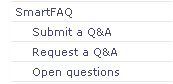
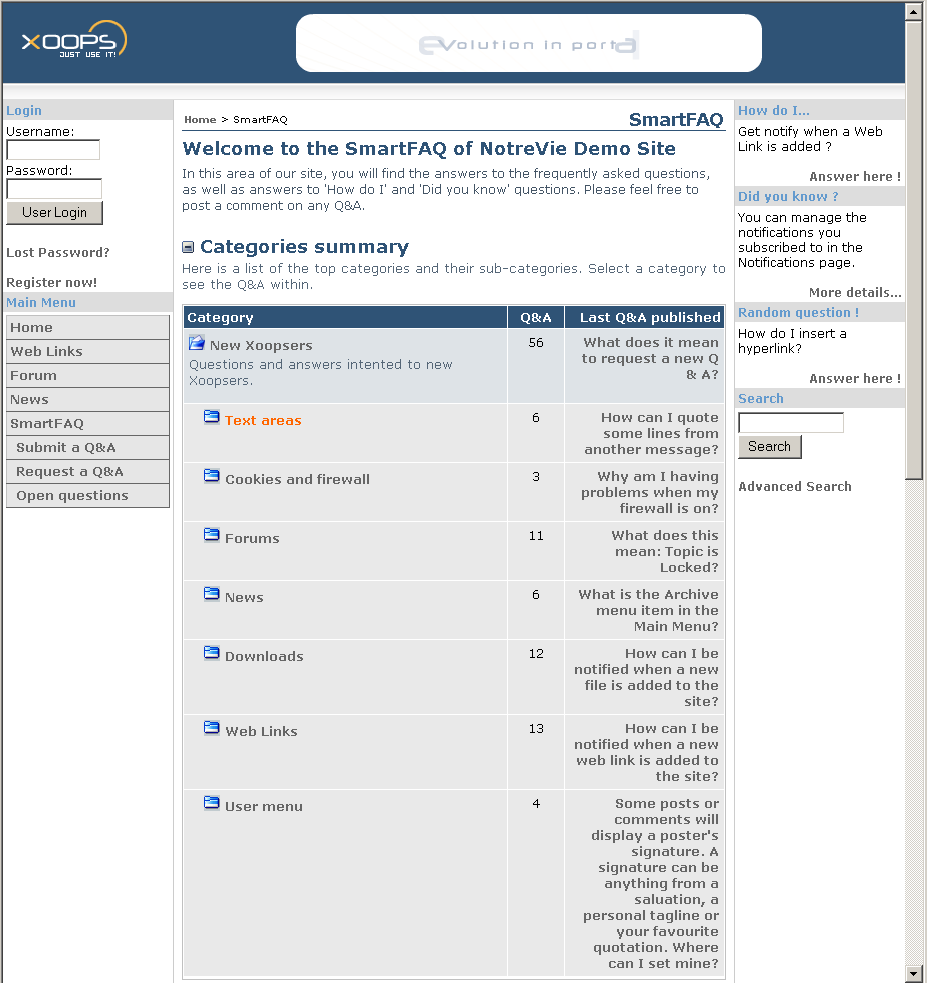

# 8.0 SmartFAQ user index page

The second part of this user guide focuses on instruction for the SmartFAQ user and the features available to them in the module.

We start with the main index page as illustrated below. This displays a typical setup and some of the ancillary information blocks to the side. 

If SmartFAQ is installed on a website, it may have been given a different name in the main menu link, but we shall assume its original name for this user guide. Clicking on SmartFAQ link in the menu, will open the module index, as below and display some sub-links in the main menu like this...

Sub-links may vary according to user group permissions.

All major SmartFAQ links are active in this image, but repeated categories and Q&As only work for the first item to demonstrate the link.
> **TIP**... click on this page first to bring it into focus. This will allow 'page down' key to work to reveal tool tips.

**Page: /modules/smartfaq/**

Fig. 20 User Index page.