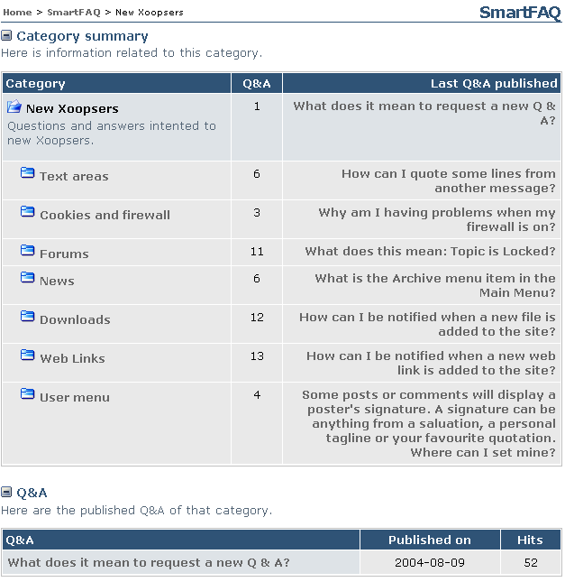

# Category Summary

The module index page begins with a Categories Summary. Each category is opened when you click on a Category text link in the main table. Any sub-categories are also displayed.

Page: /modules/smartfaq/category.php?categoryid=8 

  

Fig 21. Category summary

