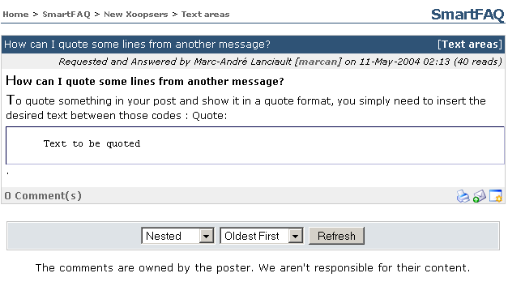

# 8.1 Category Summary

The module index page begins with a Categories Summary. Each category is opened when you click on a Category text link in the main table. Any sub-categories are also displayed.

Page: /modules/smartfaq/category.php?categoryid=8 

  

Fig 21. Category summary

## 8.2 Category Summary (link) Last Q&A published

Each category in the index page displays the last question published. Clicking the text link will open a page with details.

**Page: /modules/smartfaq/faq.php?faqid=66**

  

Fig. 22 Last QA published

## 8.3 Category summary, Sub-category (link) last Q&A published

Similar to top category text links: the last published question is displayed. Clicking the text link opens a details page. Other details are also shown such as Name of submitter, date and user reads.

**Page: /modules/smartfaq/faq.php?faqid=6 **

  

Fig. 23 Category summary, Sub-category (link) last Q&A published

## 8.4 Last published Q&A text link (top level category)

The last published Q&A text link will open a detailed page displaying both question and answer. Other details are also shown such as Name of submitter, date and user reads.

**Page: /modules/smartfaq/faq.php?faqid=66 **

  

Fig. 24 Last published Q&A text link

## 8.5 Categories- Sub-categories (text link)

Top level categories are displayed with Sub-categories beneath. Clicking a sub-category text link opens a detailed page of the sub-category, displaying category description, last Q&A published and a list of all published Q&As.

**Page: /modules/smartfaq/category.php?categoryid=1 **

  
Fig.25 Categories- Sub-categories (text link)

Fig.25 Categories- Sub-categories (text link)Fig. 24 Last published Q&A text link