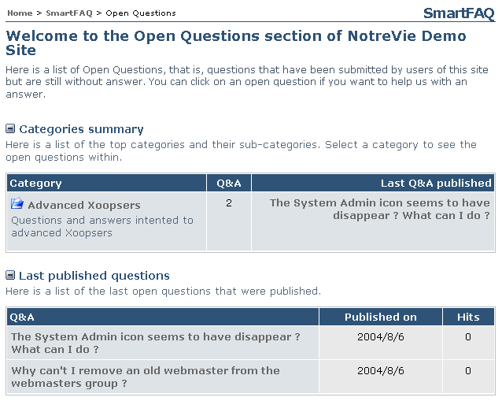
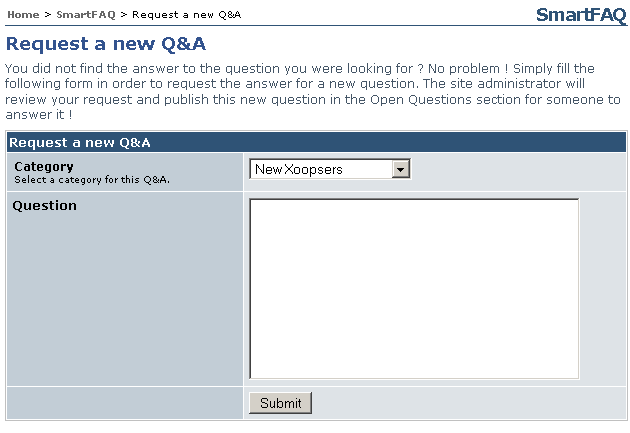

# 8.1 Category Summary

The module index page begins with a Categories Summary. Each category is opened when you click on a Category text link in the main table. Any sub-categories are also displayed.

Page: /modules/smartfaq/category.php?categoryid=8 

  

Fig 21. Category summary

## 8.2 Category Summary (link) Last Q&A published

Each category in the index page displays the last question published. Clicking the text link will open a page with details.

**Page: /modules/smartfaq/faq.php?faqid=66**

  

Fig. 22 Last QA published

## 8.3 Category summary, Sub-category (link) last Q&A published

Similar to top category text links: the last published question is displayed. Clicking the text link opens a details page. Other details are also shown such as Name of submitter, date and user reads.

**Page: /modules/smartfaq/faq.php?faqid=6 **

  

Fig. 23 Category summary, Sub-category (link) last Q&A published

## 8.4 Last published Q&A text link (top level category)

The last published Q&A text link will open a detailed page displaying both question and answer. Other details are also shown such as Name of submitter, date and user reads.

**Page: /modules/smartfaq/faq.php?faqid=66 **

  

Fig. 24 Last published Q&A text link

## 8.5 Categories- Sub-categories (text link)

Top level categories are displayed with Sub-categories beneath. Clicking a sub-category text link opens a detailed page of the sub-category, displaying category description, last Q&A published and a list of all published Q&As.

**Page: /modules/smartfaq/category.php?categoryid=1 **

  
Fig.25 Categories- Sub-categories (text link)

## 8.6 Open Questions (menu) link

SmartFAQ can show a menu link to Open Questions. Clicking this link opens a list of categories with open questions. It also lists last published open questions.

**Page: /modules/smartfaq/open_index.php **

  
Fig. 26. Open Questions(menu) link

## 8.7 Request QA (menu) link

SmartFAQ can display a main menu link Request QA. If this is configured to show, it will open the following page. This is for users to ask their own question. If approved this will be displayed in the open questions section of the module for other users to submit an answer.

Note; if Anonymous users are allowed to submit open questions, Q&As and new answers, they can not be notified if publication of their post is accepted or rejected. The image below displays anonymous posting, hence no Notify me on publish option. is displayed.

**Page: /modules/system/admin.php?fct=preferences&op=showmod&mod=24 **

  

Fig. 27 Request QA (menu) link

## 8.8 Submit a Q&A menu (link)

SmartFAQ can display Submit a QA link in the main menu. If this is configured to show, it will open the following page. In this form users can select from categories that have been made available to the group they are in. Then input a full question complete with its answer. They also have options of adding How do I ... and Did you know? versions of the QA.

>**Note; **if Anonymous users are allowed to submit open questions, Q&As and new answers, they can not be notified if publication of their post is accepted or rejected. The image below displays a registered user posting, hence a Notify me on publish option. is displayed. More details of notifications can be found here.

Page: /modules/smartfaq/submit.php?op=add

  

Fig. 28 Submit a Q&A menu (link)

## 8.9 Did you know block

If the 'Did you know ... block is displayed, the more details link will open a page displaying the full details of the information statement.

**Page: /modules/system/admin.php?fct=preferences&op=showmod&mod=24 **

  
Fig. 29 Did you know block

## 8.10 Random question (block) answer link

If the Random Question block is displayed, clicking Answer here! link opens a details page. Other details are also shown such as Name of submitter, date and user reads.

**Page: /modules/system/admin.php?fct=preferences&op=showmod&mod=24**

  

Fig. 30 Random question (block) answer link

## 8.11 How do I ... (block) answer here! link.

If The How do I ... block is displayed, the answer here link opens a detailed page showing the question and the answer.

Page: /modules/smartfaq/faq.php?faqid=50 

  

Fig. 31 How do I ... (block) answer here! link.

