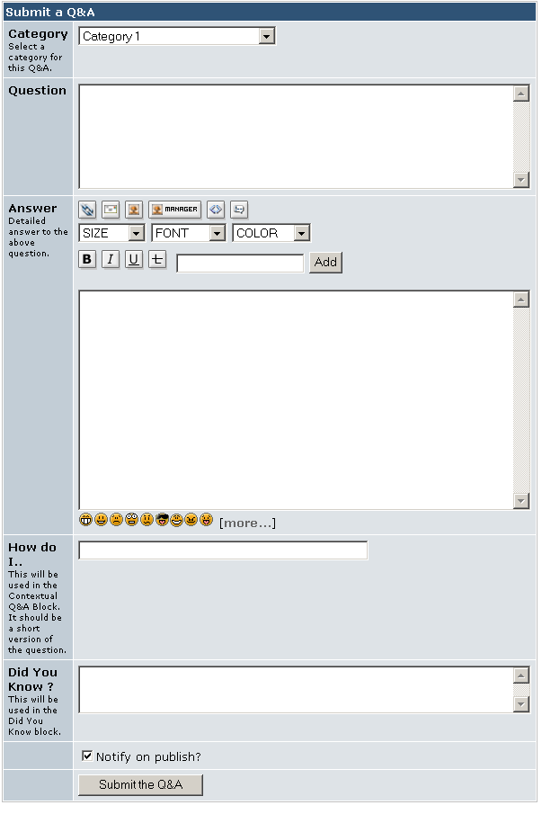

# Submit a Q&A menu (link)

SmartFAQ can display Submit a QA link in the main menu. If this is configured to show, it will open the following page. In this form users can select from categories that have been made available to the group they are in. Then input a full question complete with its answer. They also have options of adding How do I ... and Did you know? versions of the QA.

> **TIP: **if Anonymous users are allowed to submit open questions, Q&As and new answers, they can not be notified if publication of their post is accepted or rejected. The image below displays a registered user posting, hence a Notify me on publish option. is displayed. More details of notifications can be found here.

Page: /modules/smartfaq/submit.php?op=add

  

Fig. 28 Submit a Q&A menu (link)
