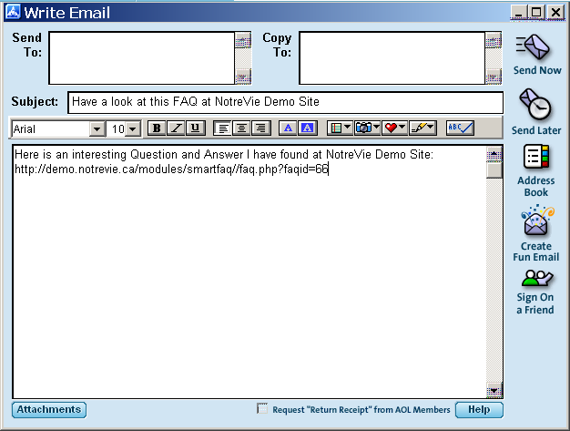

# 9.2 User Send evoked by  icon

The Send icon 0pens up your default email client write page. SmartFAQ automatically inserts Subject line, specific to your own site name. It also places a short invitation and active link in the email body for easy access.You will need to manually enter recipient details and of course any other content you wish.

  

Fig. 34. User Send icon page

