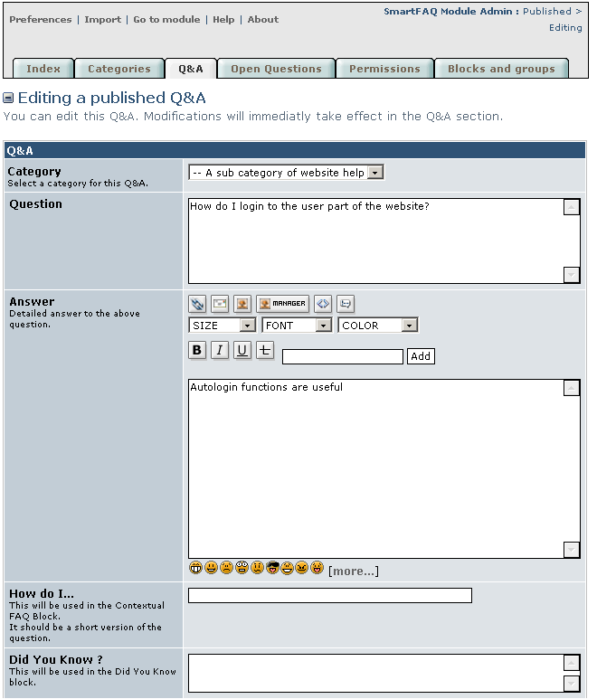

# 9:4 User edit evoked by Edit icon For full page details see Q&A page

The Edit icon is only visible to content that users have administration rights to. Ordinary users will NOT be able to edit content. The Edit a published Q&A Page opens the full creation form with all the original details inserted ready for editing. All field may be accessed and changed if required.

**Page: /modules/smartfaq/admin/faq.php?op=mod&faqid=3 **

Fig. 36. Administrator Edit page

