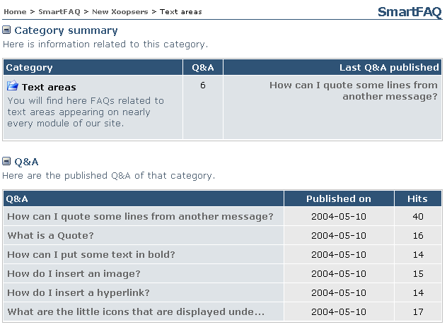

# Categories, Subcategory -text link

Top level categories are displayed with Sub-categories beneath. Clicking a sub-category text link opens a detailed page of the sub-category, displaying category description, last Q&A published and a list of all published Q&As.

**Page: /modules/smartfaq/category.php?categoryid=1** 

  
Fig.25 Categories- Sub-categories \(text link\)

