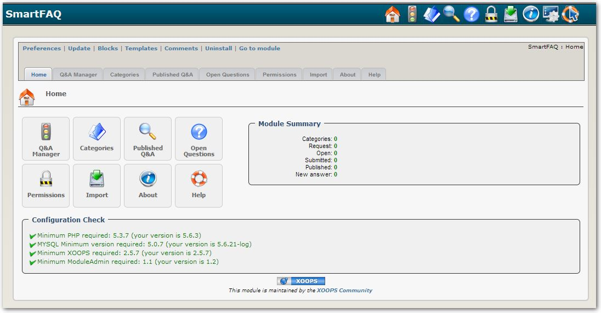

### _XOOPS Documentation Series_

# Module SmartFAQ
#### for XOOPS 2.5.7

## User Manual

© 2016 XOOPS Project (www.xoops.org)

## Module Purpose

SmartFAQ, as you would probably have guessed it by the name, is a Frequently Asked Questions system for XOOPS 2.5.7 web sites. Compared to other FAQ modules, SmartFAQ offers exciting functionalities that will help communities to quickly and easily build a complete FAQ system for their sites. Here is some of the features of SmartFAQ :

- Users can request a Q&A
- Accepted requests are published in the Open Questions section.
- Users can see, in the Open Questions section, the questions that are yet unanswered.
- Users can propose answers to these questions.
- When an answer is approved, the Q&A is published in the Q&A section.
- Each Q&A can have other information like a 'Did you know?' and 'How do I?' statement.
- These statements can be randomly displayed in blocks, along with a link for the complete answer.
- Q&A can be linked to a specific module or a specific URL.
- If such a link is made, the Contextual Q&A block will display contextual Q&A relatively to where the user is on your site.
- At any time, users can submit a better answer for a Q&A that already has an answer. This newly submitted answer will obviously need to be approved by a moderator.

*Figure 1: Main view of the Module Admin side*

## Download/Fork the Module  

**You can fork the module --> [here](https://github.com/XoopsModules25x/smartfaq))** 

## How to Contribute

[You can contribute on GitHub](https://github.com/XoopsDocs/smartfaq-tutorial). Changes will be [pushed to Gitbook.io automatically](https://www.gitbook.com/book/xoops/smartfaq-tutorial/activity) when the [main repository](https://github.com/XoopsDocs/smartfaq-tutorial) changes.

Editing the book can be done either by updating the markdown files with a text editor, or opening the repository in [the Gitbook desktop app](https://github.com/GitbookIO/editor/blob/master/README.md). The desktop app will give you a live preview option.

# Table of Content

* [Overview](book/0introduction.md)  
* **Administrators Guide**  
* [Install/Uninstall](book/admin/1install.md)
* [Administration Menu](book/admin/2administration.md)
* [Import Function](book/admin/2import.md)
* [Operating Instructions](book/admin/4.0operations.md)
    * [Preferences](book/admin/4.1preferences.md)
    * [Display Type, Pagination](book/admin/4.1preferences2.md) 
    * [Categories](book/admin/4.2categories.md)
    * [Permissions](book/admin/4.3permissions.md)
    * [Blocks & Groups](book/admin/4.4blocks.md)
    * [Q&A Entering Question and Answers](book/admin/4.5entering_q+a.md)
    * [Open Questions](book/admin/4.6openquestions.md)
    * [Managing content in SmartFAQ module](book/admin/4.7.0managingcontent.md)
        * [Sort Order & Status options](book/admin/4.7.1sortorder.md)
        * [Edit submissions.](book/admin/4.7.1editsubmission.md)  
* **Guide for Users**   
* [The module index page.](book/users/8.0IndexPage.md)
* [Category Summary - text link](book/users/8.1Category Summary.md)
* [Category Summary - link Last Q&A published](book/users/8.2summarylastlink.md)
* [Category summary, Sub-category - link last Q&A published](book/users/8.3summarysubcategory.md)
* [Last published Q&A - link](book/users/8.4lastpublished.md)
* [Categories, Subcategory -text link](book/users/8.5subcategories.md)
* [Open question menu - link](book/users/8.6openquestion.md)
* [Request QA menu - link](book/users/8.7requestmenu.md)
* [Submit a Q&A menu - link](book/users/8.8submitmenu.md)
* [Blocks](book/users/8.9Blocks.md)
    * Did you know? block -More details link
    * Random question block answer link
    * How do I ... block answer here! link
* [User Icons](book/users/9.0UserIcons.md)
    * [User- Print](book/users/9.1User-Print.md)
    * [User- Send](book/users/9.2User-Send.md)
    * [User- New Answer](book/users/9.3User-NewAnswer.md)
    * [User- Edit](book/users/9.4User-Edit.md)
    * [User- Delete](book/users/9.5User-Delete.md)
* [Entering Content.](book/users/10EnterContent.md)
* [Notifications](book/users/11Notifications.md)
* [Notification template examples](book/users/11.1NotificationsTemplates.md)
* [Module Credits](book/9credits.md)
  **References**  
* SmartFAQ Workflow Charts
    * [SmartFAQ Workflow](book/references/workflow1.md)
    * [FAQ Notifications](book/references/workflow2.md)
    * [Question Notification](book/references/workflow3.md)
* [Applications](book/references/12.1Applications.md)
* [Dublin Core Metadata](book/references/12.2Dublin.md)
* [XOOPS Content Management System](book/references/12.4XOOPS.md)

##License:

 Unless specified, this content is licensed under a <a rel="license" href="http://creativecommons.org/licenses/by-nc-sa/4.0/">Creative Commons Attribution-NonCommercial-ShareAlike 4.0 International License</a>.

All derivative works are to be attributed to XOOPS Project ([www.xoops.org](http://xoops.org))
