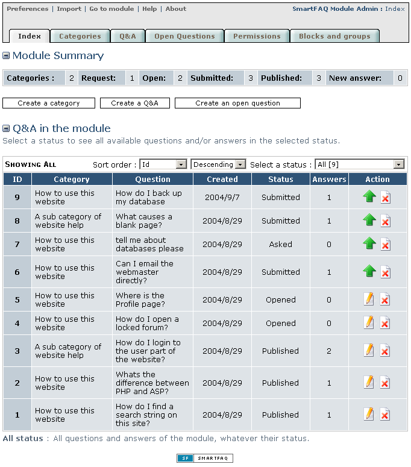

# Administration

**Configuration**

We need to setup preferences and create at least one category before the module becomes functional. Before we do this let's visit the main index page and see what's available in the administration section. This image shows the index page on initial installation. Both 'Module summary' and 'Q&A in the module' tables will display content once the categories and questions have been entered. Please note. The module will not display any content until at least one category has been created.

Page: /modules/smartfaq/admin/index.php

