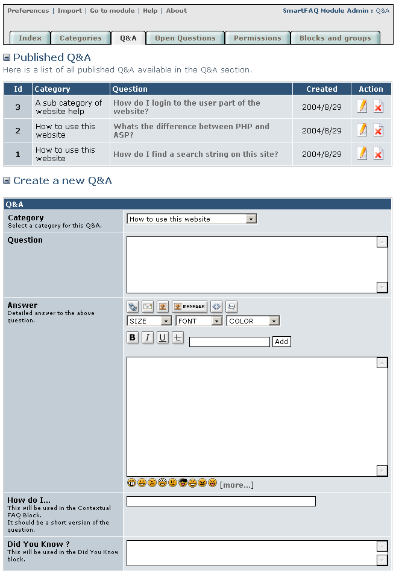
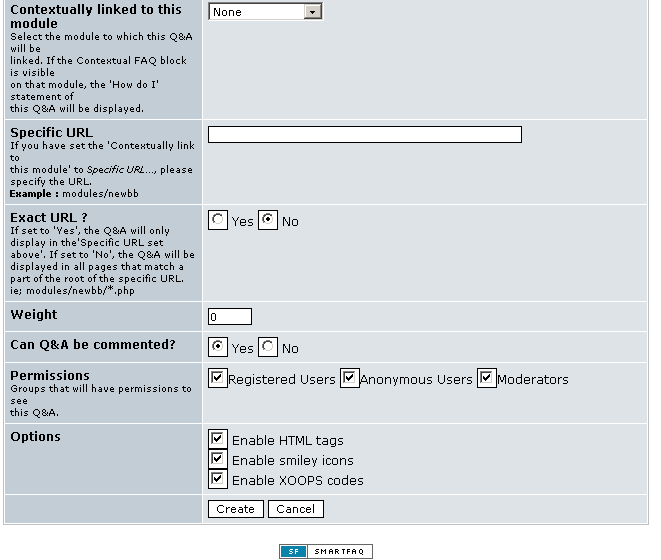

# Q&A Entering Question and Answers as Admin

It may seem like we've spent a lot of time setting up the module and not added any content yet! True enough, but many of these settings will not need to be changed again, unless you adjust the design of your site. SmartFAQ is a sophisticated module with several admin and user features. Hopefully going through the administration screens will have helped to make you more familiar with its functions.

At last we can begin to add real content to the SmartFAQ module. We have some options to consider, but there are 2 main types of content.

1- **A question and its associated answer**. This is set in the Q&A tab as displayed in page-1 below. The Q&A combination can be displayed in different ways. For example; [ How do I ...] [ Did you know ? ] and [ Contextually linked block ] These options can be clearly seen in the image below and following page.

Q&As can also be open for users to submit new answers. In fact, whenever a user sees and clicks this  icon. New answer button, an answer submission screen is displayed. This is of course dependant on how the administrator configures the module to allow user submissions and to which groups. We will talk more about this when we explain the User side of the module.

2- **An open question**. This is simply a question that does not have an answer yet, but it may be displayed on the site so that visitors can submit their own answers. These answer submissions to open questions are not immediately published, but are first reviewed by administrators before publishing. Admins. can review and edit answers as they wish before publication. Alternatively, they can discard an answer submission.

Lets continue by looking at the Q&A page and detailing the main features and how to use them. The submission form in this page is similar to the form displayed on the user side of the module when a 'Submit Q&A ' button is pressed. Of course users will not see any administration settings.

Page: /modules/smartfaq/admin/faq.php

Fig. 15 Q&A page.