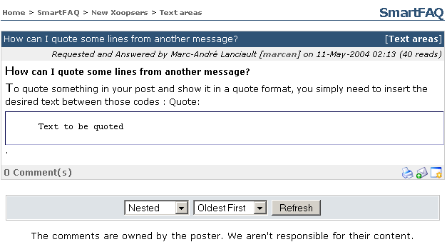

# Sub-category (link) last Q&A published

Similar to top category text links: the last published question is displayed. Clicking the text link opens a details page. Other details are also shown such as Name of submitter, date and user reads.

**Page: /modules/smartfaq/faq.php?faqid=6 **

  

Fig. 23 Category summary, Sub-category (link) last Q&A published
