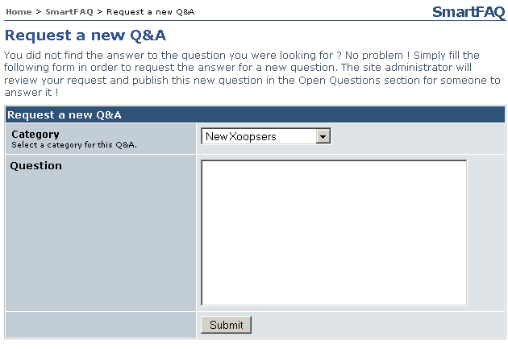

# Request QA (menu) link

SmartFAQ can display a main menu link Request QA. If this is configured to show, it will open the following page. This is for users to ask their own question. If approved this will be displayed in the open questions section of the module for other users to submit an answer.

Note; if Anonymous users are allowed to submit open questions, Q&As and new answers, they can not be notified if publication of their post is accepted or rejected. The image below displays anonymous posting, hence no Notify me on publish option. is displayed.

**Page: /modules/system/admin.php?fct=preferences&op=showmod&mod=24 **

  

Fig. 27 Request QA (menu) link
