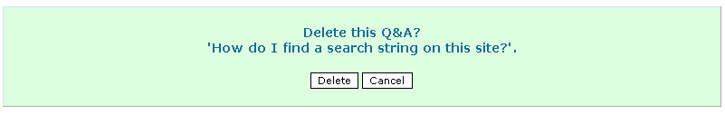

# 9.5 User Delete evoked by Delete icon 

The **Delete** icon  is only visible to content that users have administration rights to. Ordinary users will NOT be able to delete. content. On clicking the delete icon a confirmation screen is first displayed as below. Note if any content is deleted from the module, it will also delete all associated comments associated. This is to remove the possibility of orphaned data and confusing material.

**Page: /modules/smartfaq/admin/faq.php?op=del&faqid=3 **

  

Fig. 37. Administrator Delete page.