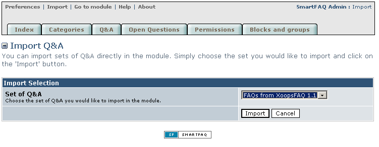
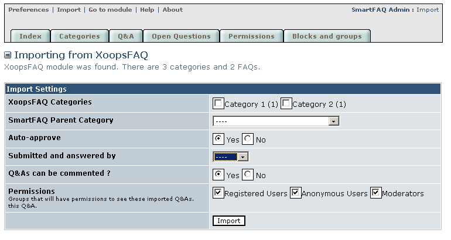
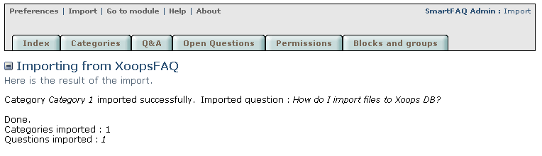

# Import Function

SmartFAQ allows you to keep and reuse all your existing data if you have either Xoops FAQ or WF-FAQ installed on your system. It also gives you useful options to control how the material is displayed, authored and which groups can view it. The following images represent a typical import sequence for data from the XoopsFAQ 1.1 module. This import section has been shown early in the guide, so that you are aware of the feature and can plan your content categories accordingly if required.

>  **TIP:** You must create at least one category in the SmartFAQ module before importing any files.

**Page: /modules/smartfaq/admin/import.php**

1- Select an existing module to import from and click Import

2- Make import settings for your content

3- Cut-away of category selector showing categories and subcategories indented

4- Successful import of data: summarizing material imported to module.

Fig. 4 Import routine

