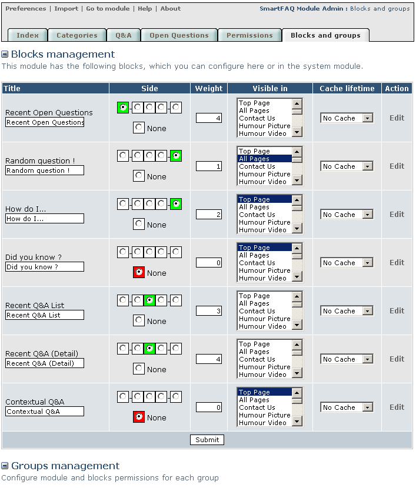
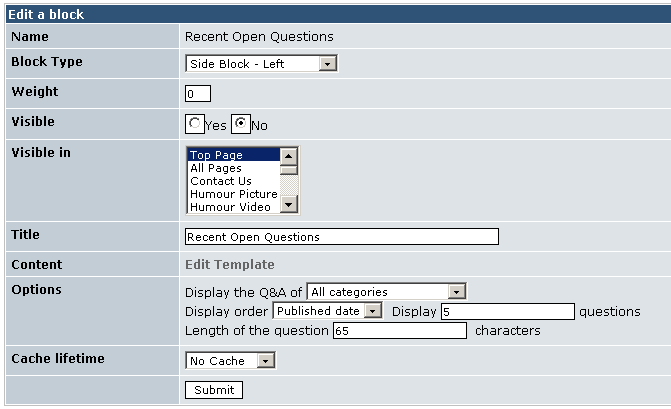
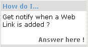
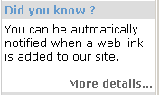
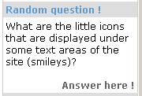
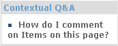
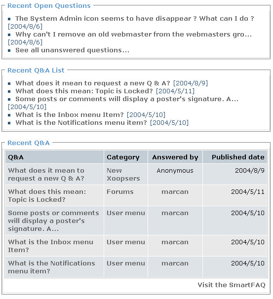

# Blocks & Groups

Blocks and Groups page combines administration/Blocks and administration/Groups settings that you usually have to go to after you have installed a module. The difference is that SmartFAQ displays only settings related to the module and nothing else. When you make settings here and then go to your usual blocks and groups pages, you will see that all this data has been registered in the usual way. It's simply much easier and more convenient. You will see that there is an edit link after each block description. We will look at the edit page in section 5:1

Page: /modules/smartfaq/admin/myblocksadmin.php

Fig. 12 Blocks and groups page

>  **TIP: How to moderate in SmartFAQ?**
>
> You could create a group in your system admin. called 'Moderators' Place your moderators in this group and give them 'SmartFAQ Module Access Rights' They will now be able to see all the edit and delete links in the module content and also access the administration link, but ONLY to the SmartFAQ module. \( Caution; They will have ALL rights to this module \)

## Blocks and Groups- Edit

The blocks and groups page displays an edit link after each block. Clicking this link opens an individual edit page similar to the one in this image. Not all blocks offer the options section shown here.

Page: /modules/system/admin.php?fct=blocksadmin&op=edit&bid=65 \(and various for each block\)

Fig. 13 A typical block edit page

## Blocks- a guide to content type

This page displays all seven SmartFAQ blocks as seen on the user web page. This is to demonstrate the type of block content in order to guide the administrator to set blocks in suitable positions on the page. For more details on what the links show, read User Index page and see the blocks interactively. Basically, any link will open a \|Q&A \| Open question \| category \| user details \| Links are identified in these images by Grey bold text

>  **TIP:** Remember ... All block lables can be re-named in Administration.

Examples of Side panel blocks:

 Click Answer here !To open new page

 Click More details ... To open new page

 Click Answer here ! To open new page

 Click The question. To open new page

Examples of Inline blocks In all cases, click the titles or the questions to activate the answer page.

Fig. 14 Typical blocks examples

