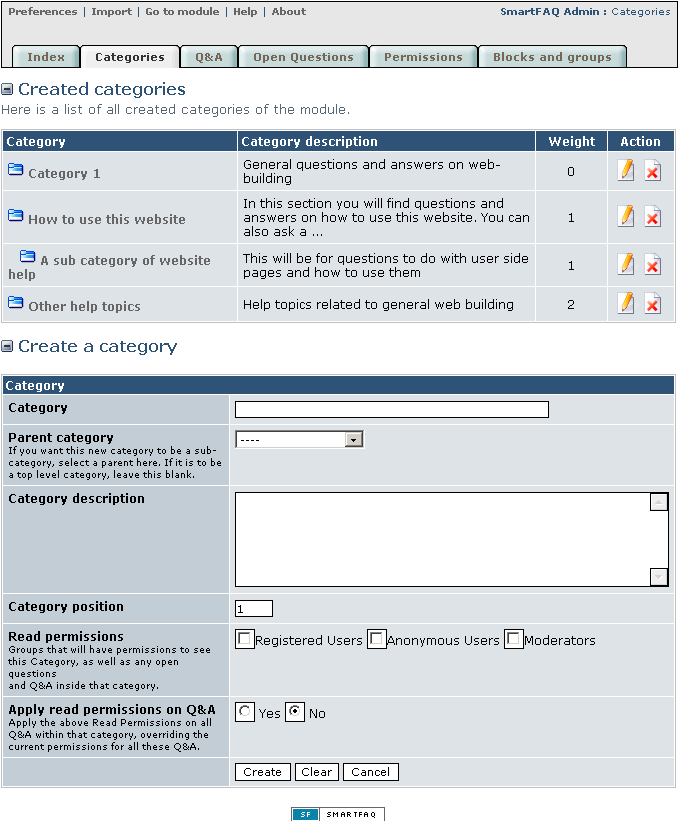
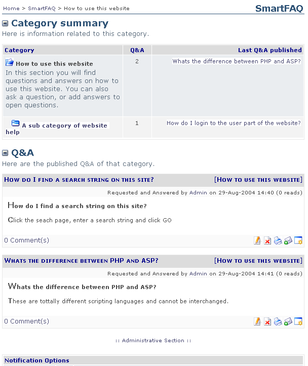

# Categories

Moving on to the next area of the administration setup, we need to create at least one category in order to input and display content in the module. The categories page is accessed either by the link in the module icon or from the tab menu that heads the administration pages. The Category page displays two main regions; The first is a list of Created categories showing all Categories and sub-categories. This can be hidden by clicking the  \(close icon\) The second region is a **Create category** form allowing administrators to create categories and sub-categories. This can also be hidden by clicking the  \(close icon\). Clicking the ensuing  \(open icon\) Returns the data.

**Create category.**

Initially SmartFAQ will not have any categories and you will need to plan and create these before using the module. Lets begin by inputting details of a new category in the form.

**Editing categories.**

Once you have created a category it will appear in the Created Categories list. It will include a truncated description, weight position and edit / delete icons. The category names will be shown as clickable links that open the category on the module web page. This allows administrators a full view of the category details before taking any actions to edit or delete. The Web Pages in turn will display an Click for more details about Category button  \(Category icon\) before its description Clicking this will bring you straight back to the original administration page to continue any actions. This same procedure applies to sub-categories, except you will see the  \(sub-category icon\)

> **NOTE:** SmartFAQ features a very flexible permission system. This allows administrators to grant viewing access of any category to any group in the system. This also applies to sub-categories, BUT users in a group can only view a sub-category if it also has access to its parent category. Viewing permissions can also be decided on a specific question basis, both for Q&As and Open questions. To allow a specific question to be visible to any group means it must also be in a category that also has permission to be viewed by that group. Users may be in more than one system group, so care should be taken before setting up complex SmartFAQ configurations.

**Page: /modules/smartfaq/admin/category.php**

## Categories: Viewing categories in web page as administrator:

**Page: /modules/smartfaq/category.php?categoryid=1**

This image shows tool tips to show Administrators links to edit/ delete categories while logged in and viewing the module webpage.

Fig. 10 Categories page showing administration options

