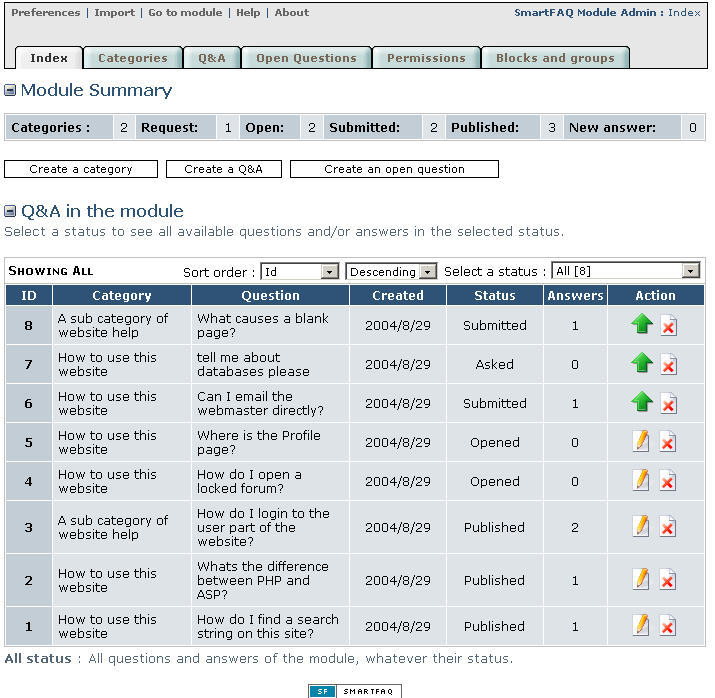

# Managing content in SmartFAQ module

If you have followed this guide in a logical order, you have now set up, configured and entered some categories and content in the SmartFAQ module. In previous help pages we have referred to table lists that become populated with questions and answers and open questions. Let's describe what these look like and explain the editing and management tools for organising your content. These screens will look familiar, except for the display of content in the tables.

The image below shows the main admin index page. You can now see the module summary and also the Q&As in the module. Initially the page will show ALL types of content and any status.

In order to make your management easier SmartFAQ provides two powerful filter options for displaying the module contents. **Sort order** and '**select a status**'. These selectors will affect all content displayed in the main table list. This allow the administrators to filter from several different options and combinations making the task of reviewing, editing, approving, and rejecting material much easier.

Lets move over the image to get detailed explanations of the table, then on the next page we will detail each filter screen.

**Page: /modules/smartfaq/admin/index.**

