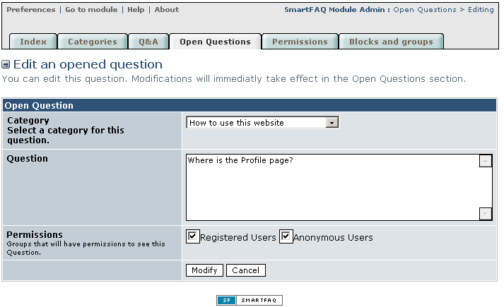
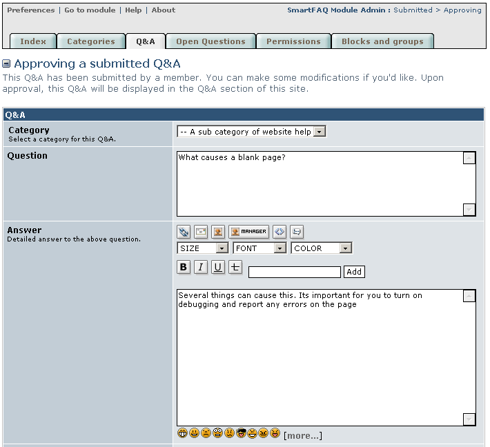
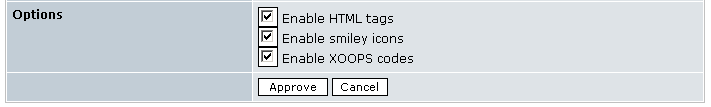

# Edit submissions.

In the Administration index page all the material for the module will be displayed with either a **Moderate** or **Approve** icon against it.

Clicking either an **edit button**  or the **Moderate button**  will automatically open the selected item in its appropriate creation form. The difference is that the edited text will be saved with a Modify for editing orApprove for moderating button. \(see images below. No popup information supplied\).

**Page: /modules/smartfaq/admin/question.php?op=mod&faqid=5**

 

Fig. 19 Edit content pages.

