# Sort Order & Status options

On this page we see the details of the selector filters displayed in the administration index summary table. The two filters are Sort order and Select a status These filters offer several options and can work together to display various content types from the module.

**Page: /modules/smartfaq/admin/index.php**

## Filter 1- 'Sort order' filter options \(with descriptions of actions\)

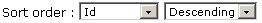 In this filter the following options and actions can be selected:

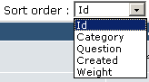

\[Selector opened\]

| Option | Action |
| --- | --- |
| Id | Lists all items according to their ID number. These are created sequentially by the system. |
| Category | Lists all items according to their category. Categories are displayed Alphabetically, via second selector below |
| Question | Lists all items Alphabetically. May be reversed via second selector below. |
| Created | List all items by date of creation. May be reversed by second selector below. |
| Weight | Lists all items by weight. The order of display. This may be set manually when creating or editing an item. |

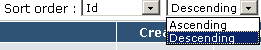

\[Selector opened\]

| Option | Action |
| --- | --- |
| Ascending | Whatever option was chosen on the first selector will be displayed with the lowest number or letter first and then **ascending** i.e. 1&gt;&gt; or A &gt;&gt; |
| Descending | Whatever option was chosen on the first selector will be displayed with the Highest number or letter first and then **descending** ie; X&lt;&lt; or Z &lt;&lt; |

The results of these initial selector filters may now be applied to the second range of options as detailed below to provide a comprehensive range of display lists.

These following images detail 9 filter options that can be selected from theStatus selector. The previous help page shows the 'Show all' which is the 10th option in the list. Notice that each filter page has its own detailed description of what type of SmartFAQ content is being displayed and what area of the module it comes from.

## Filter 2- 'Select a status' filter options \(with image details of each option\)

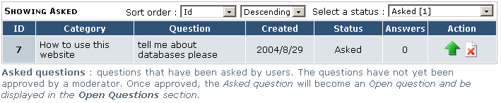

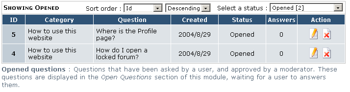

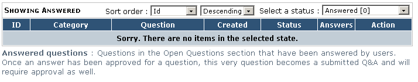

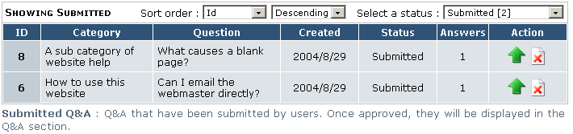

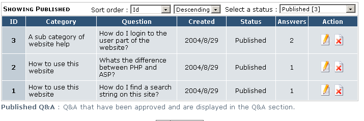

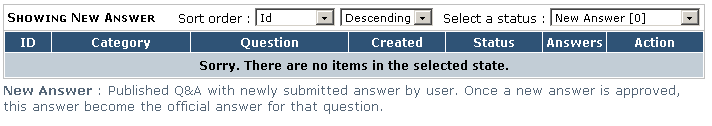

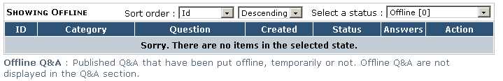

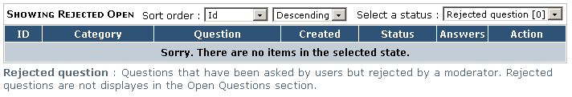

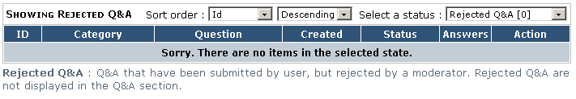

Fig. 18 Various status filter pages

