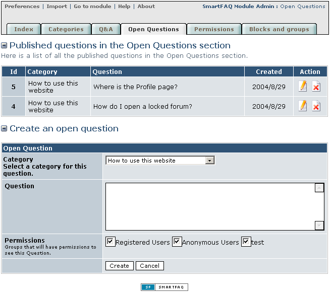

# Open Questions

The second type of content is an open question. It follows a similar format to **Q&As**. \( In the previous page\) This is a simple form that allows questions to be placed in selected categories and displayed in a list of open questions. The user will see a list of categories with the last open question attached to them and also a list of all published open questions. The input form here is a similar form as displayed in the module user page when users submit their own questions for publication, except without permissions options.

Page: /modules/smartfaq/admin/question.php

Fig. 16 Open questions page

