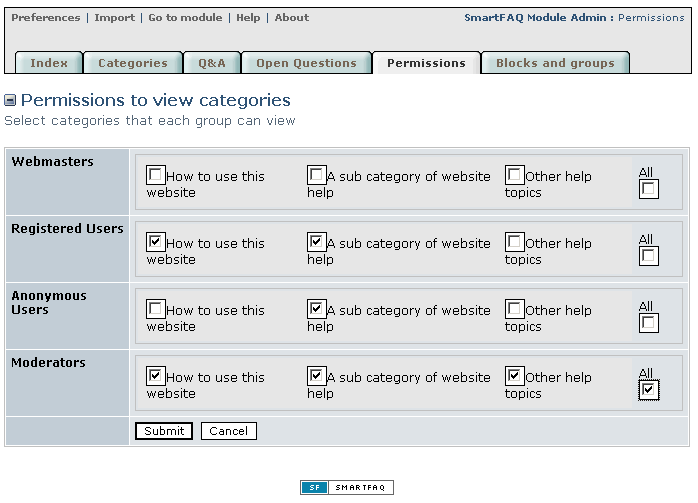

# Permissions

When you create a SmartFAQ category, it has check box options to allow any group on your system to view that category.\(see Read Permissions in the category page\).

Read Permissions is very similar to the permissions page. The main difference is as follows;

1- In the Category page groups are selected for the specific category, while in the Permissions page Categories are selected against groups. You will always notice that whatever is set in one page is reflected in the other.

2- The permissions page is a better way to display all groups and their associated categories in one place.

>  **NOTE:** Permissions set in Categories and Permissions tabs are dynamically linked, whatever you do in one is shown in the other.

Page: /modules/smartfaq/admin/permissions.php

Fig. 11 Permissions page

