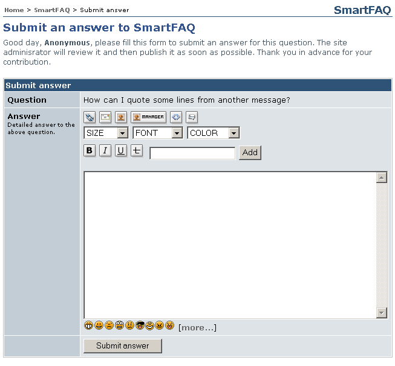

# User- New Answer

Where this **New Answer** icon  is displayed, it allows users to add their own answer to open questions and also to exiting questions and answer combinations \(**QAs**\) that may already be displayed.

> **Note**: if Anonymous users are allowed to submit open questions, Q&As and new answers, they can not be notified if publication of their post is accepted or rejected. The image below displays anonymous posting, hence no **Notify me on publish option** is displayed. More details of notifications can be found here.

**Page: /modules/smartfaq/answer.php?faqid=6** 

Fig. 35. User New Answer page

