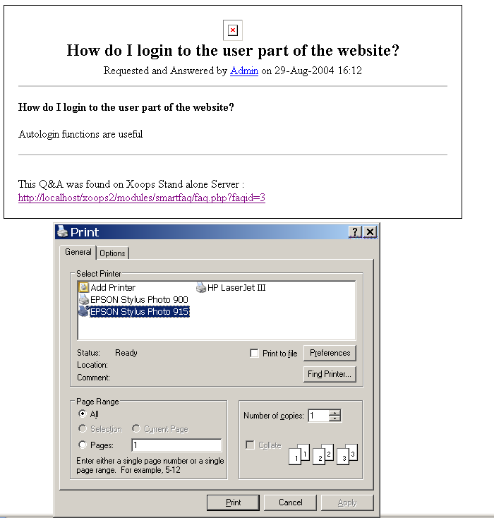

# User- Print

The **Print** icon  displays the selected item in an unformatted, plain text version suitable for easy printing. Note Details added and a link to the page content as reference. Your printer dialogue box is also evoked selecting your default printer ready for action.

**Page: /modules/smartfaq/print.php?faqid=3** 

Fig. 33 User Print icon page

